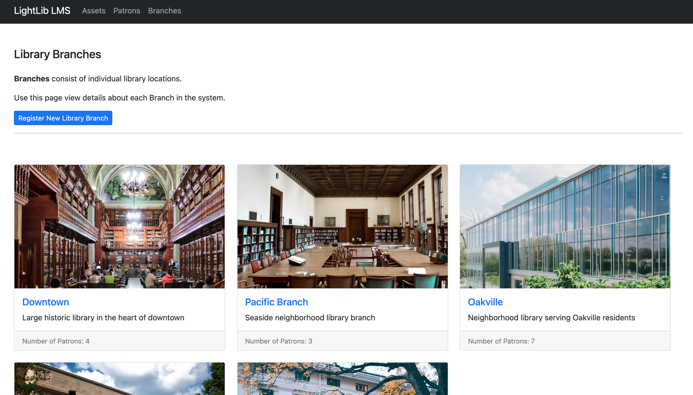
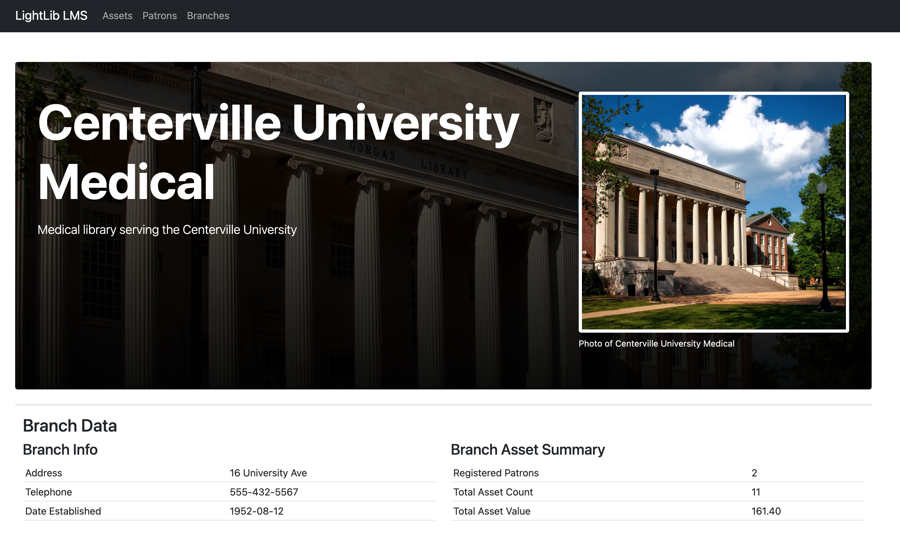

# LightLib Library Management System (LMS)

A lightweight library management system built in .NET 5.0 with Entity Framework Core.  Enables library administrators to manage Library Assets, Patrons, and Branches with basic functionality.

This project is intended to serve as a long-term resource for small .NET web monoliths.

## Stack

- PostgreSQL 13.1 (running in Docker for development)
- ASP.NET 5.0 MVC with Entity Framwork Core
- Standard Razor views with Bootstrap 5

## Documentatin (WIP)

### Library Branch Management

### Library Asset Management

### Library Patron Management
